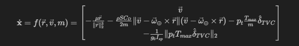
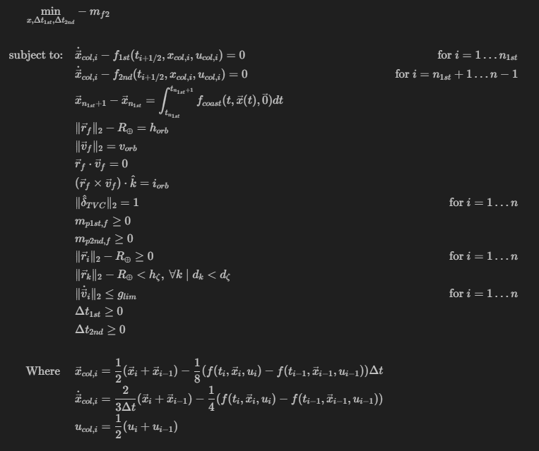

# Thumper Trajectory Optimization Software

## Overview

This repository contains software for optimizing trajectories for the Thumper two-stage launch vehicle. The software utilizes advanced optimization algorithms to find optimal trajectories based on user-defined constraints and objectives.

## Features

- Direct collocation trajectory optimization method customized for Thumper launch vehicle and launch operation.
- Post analysis of the optimal trajectory solution including payload g-loading, dynamics pressure, and dynamic state profile plots

## Optimization Visualization

- Visualization of optimization applied on initial conditions resulted from a rough forward rollout

- Visualization of optimization applied on constant dynamic state profile with random control inputs

## Detailed Description

### Dynamic Model

The dynamic model utilized in the trajectory optimization software is based on a three-degree-of-freedom (3DOF) dynamics model. It includes the following assumptions:

1. Three degree of freedom (3DOF) Dynamics.
2. Newtonian gravity model and perfectly spherical Earth with a radius of 20,925,000 ft.
3. NASA standard atmosphere model without local atmosphere disturbances.
4. Zero lift generated and a constant high coefficient of drag of 0.5.

The dynamic model is established and evaluated in an Earth-Centered Inertia frame and recognizes seven dynamical states and four control signals. Details can be find in `rocket.m`

### Optimization Problem Setup

Various constraints are applied to the formulation - collocation constraint for dynamic feasibility; stage separation coast state constraint to link the two-stage propulsion phases together; final orbit constraint; thrust pointing constraint; propellant mass constraint; above the surface constraint; airfield clearance constraint; payload g-loading constraint; and physical time step constraint. The completed optimization problem formulation is shown below

