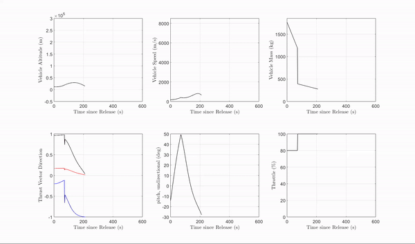
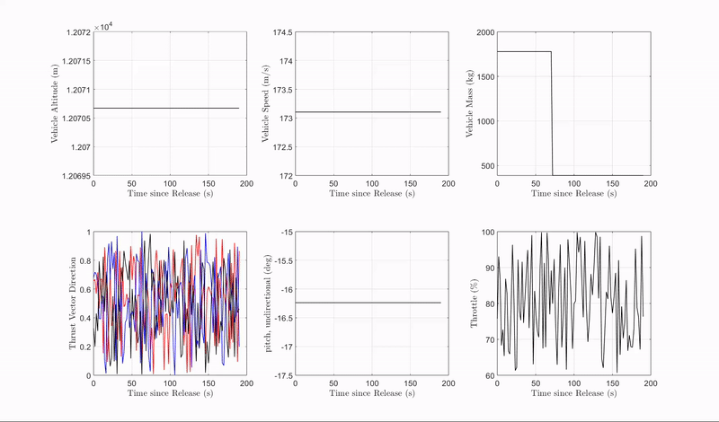

# Thumper Trajectory Optimization Software

## Overview

This repository contains software for optimizing trajectories for the Thumper two-stage launch vehicle. The software utilizes advanced optimization algorithms to find optimal trajectories based on user-defined constraints and objectives.

## Features

- Direct collocation trajectory optimization method customized for Thumper launch vehicle and launch operation.
- Post analysis of the optimal trajectory solution including payload g-loading, dynamics pressure, and dynamic state profile plots

## Optimization Visualization

- Visualization of optimization applied on initial conditions resulted from a rough forward rollout

- Visualization of optimization applied on constant dynamic state profile with random control inputs

## Detailed Description

### Dynamic Model

The dynamic model utilized in the trajectory optimization software is based on a three-degree-of-freedom (3DOF) dynamics model. It includes the following assumptions:

1. Three degree of freedom (3DOF) Dynamics.
2. Newtonian gravity model and perfectly spherical Earth with a radius of 20,925,000 ft.
3. NASA standard atmosphere model without local atmosphere disturbances.
4. Zero lift generated and a constant high coefficient of drag of 0.5.

The dynamic model is established and evaluated in an Earth-Centered Inertia frame and recognizes seven dynamical states and four control signals. Details can be find in `rocket.m`

$$
\dot{\mathbf{x}} = f(\vec{r},\vec{v},m) = 
\begin{bmatrix}
\vec{v} \\
-\frac{\mu \vec{r}}{\|\vec{r}\|_2^3}-\frac{\rho S C_D}{2m}\|\vec{v}-\vec{\omega}_{\oplus} \times \vec{r}\|(\vec{v}-\vec{\omega}_{\oplus} \times \vec{r}) - p_{t} \frac{T_{max}}{m} \hat{\delta}_{TVC}\\
-\frac{1}{g_0I_{sp}} \|p_{t} T_{max} \hat{\delta}_{TVC}\|_2
\end{bmatrix}
$$

### Optimization Problem Setup

Various constraints are applied to the formulation - collocation constraint for dynamic feasibility; stage separation coast state constraint to link the two-stage propulsion phases together; final orbit constraint; thrust pointing constraint; propellant mass constraint; above the surface constraint; airfield clearance constraint; payload g-loading constraint; and physical time step constraint. The completed optimization problem formulation is shown below

$$
\begin{align*}
\min_{x,\Delta t_{1st},\Delta t_{2nd}} & -m_{f2}\\ \\
\textrm{subject to:\quad} & \dot{\vec{x}}_{col,i}-f_{1st}(t_{i+1/2},x_{col,i},u_{col,i}) = 0 & \textrm{for } i = 1 \dots n_{1st}\\
& \dot{\vec{x}}_{col,i}-f_{2nd}(t_{i+1/2},x_{col,i},u_{col,i}) = 0 & \textrm{for } i = n_{1st}+1 \dots n-1\\
& \vec{x}_{n_{1st}+1}-\vec{x}_{n_{1st}} = \int_{t_{n_{1st}}}^{t_{n_{1st}+1}} f_{coast}(t, \vec{x}(t), \vec{0}) dt\\
& \|\vec{r}_f\|_2-R_{\oplus} = h_{orb}\\
& \|\vec{v}_f\|_2 = v_{orb}\\
& \vec{r}_f \cdot \vec{v}_f = 0\\
& (\vec{r}_f \times \vec{v}_f) \cdot \hat{k} = i_{orb}\\
& \|\hat{\delta}_{TVC}\|_2 = 1 & \textrm{for } i = 1 \dots n \\
& m_{p1st,f} \ge 0 \\
& m_{p2nd,f} \ge 0 \\
& \|\vec{r}_i\|_2-R_{\oplus} \ge 0 & \textrm{for } i = 1 \dots n \\
& \|\vec{r}_k\|_2-R_{\oplus} < h_{\zeta}, \ \forall k \mid d_k < d_{\zeta}\\
& \|\dot{\vec{v}}_i\|_2 \le g_{lim} & \textrm{for } i = 1 \dots n \\
& \Delta t_{1st} \ge 0 \\
& \Delta t_{2nd} \ge 0 \\ \\
\textrm{Where \quad} & \vec{x}_{col,i} = \frac{1}{2}(\vec{x}_i + \vec{x}_{i-1}) - \frac{1}{8}(f(t_i,\vec{x}_i,u_i)-f(t_{i-1},\vec{x}_{i-1},u_{i-1}))\Delta t\\
& \dot{\vec{x}}_{col,i} = \frac{2}{3 \Delta t}(\vec{x}_i + \vec{x}_{i-1}) - \frac{1}{4}(f(t_i,\vec{x}_i,u_i)-f(t_{i-1},\vec{x}_{i-1},u_{i-1}))\\
& u_{col,i} = \frac{1}{2}(u_i + u_{i-1})
\end{align*}
$$
